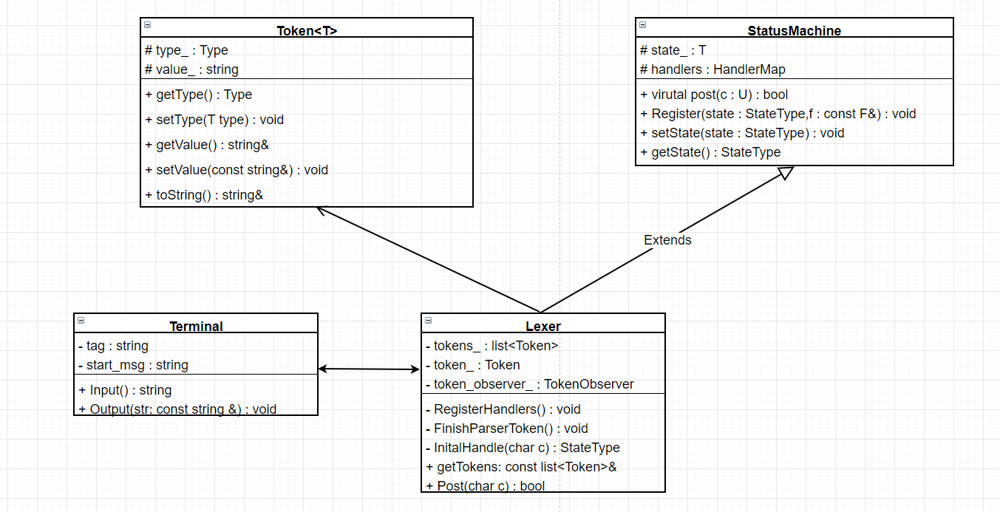

# lexer

This lab is to complete a simple lexical analyzer which parse string to tokens.For example, input the code of `int n = 2;`  to lexical analyzer,it will be resloved as follows
```
< Int : int
< Identifier : n
< Operator : =
< IntLiteral : 2
```

In order to parse string like this,we have to design a finite-state machine.To improve state machine scalability,we can use template and polymorphic to design an interface class.it includes state and state of handlers,user can custom status and add handlers to slove it.
```cpp
template <typename T, typename U, typename F>
class StatusMachine {
public:
    using HandlerMap = std::unordered_map<T, F>;
    using StateType = T;
    using ValueType = U;

    StatusMachine() = default;

    StatusMachine(StateType state, const HandlerMap &m = HandlerMap())
        : state_(state), handlers_(m) {}

    void Register(StateType state, const F &f) {
        handlers_[state] = f;
    }

    void Register(const HandlerMap &m) {
        handlers_.insert(m.begin(), m.end());
    }

    void setState(StateType state) {
        state_ = state;
    }
    void getState() const {
        return state_;
    }

    virtual bool Post(U c) = 0;

    virtual ~StatusMachine() {}

protected:
    StateType state_;
    HandlerMap handlers_;
};
```


the next is to design token.In order to improve expansibility we also design it to a class template so that it can save different type by template typename.

```cpp
template <typename T, typename = std::enable_if_t<std::is_enum_v<T>>>
class Token {
public:
    Token() = default;

    Token(T type, const std::string &v = "") : type_(type), value_(v) {}

    Token(const Token &rhs) : type_(rhs.type_), value_(rhs.value_) {}

    Token(Token &&rhs) noexcept : type_(rhs.type_), value_(std::move(rhs.value_)) {}

    Token& operator=(Token rhs) {
        rhs.swap(*this);
        return *this;
    }

    bool operator==(const Token &rhs) const {
        return type_ == rhs.type_ && value_ == rhs.value_;
    }

    bool operator!=(const Token &rhs) const {
        return !(*this == rhs);
    }

    void swap(Token &rhs) {
        std::swap(type_, rhs.type_);
        std::swap(value_, rhs.type_);
    }

    T getType() const {
        return type_;
    }

    void setType(T type) {
        type_ = type;
    }

    Token& operator>>(char ch){
          value_.push_back(ch);
          return *this;
    }

    const std::string &getValue() const {
        return value_;
    }

    template <typename V>
    void setValue(V &&value) {
        value_ = std::forward<V>(value);
    }

    std::string toString() const {
        std::stringstream ss;
        ss << TypeCast<T>()(type_) << " : " << value_;
        return ss.str();
    }

protected:
    T type_;
    std::string value_;
};
```

Now we can degisn a simple lexer with Token and StatueMachine.firstly, we can  definition the type of token and state of machine.
```cpp
enum class State {
    Initial,
    Id,
    Int,
    Int1,
    Int2,
    Int3,
    IntLiteral,
    Plus,           //  +
    Sub,            //  -
    Mul,            //  *
    Divide,         //  /
    LeftParen,      //  (
    RightParen,     //  )
    Assignment,     //  =
    SemiColon,      //  ;
    GreaterThan,    //  >
    GreaterEqual,   //  >=
    LessThan,       //  <   
    LessEqual,      //  <=
    Equal           //  ==
};
```
Since we wiil output the token information,so we define a marco map which can reduce the code of type casting to string.
```cpp
#define TypeMap(XX)                                                                                \
        XX(Identifier, Identifier)                                                                 \
        XX(Operator, Operator)                                                                     \
        XX(IntLiteral, IntLiteral)                                                                 \
        XX(Int,Int)


enum Type {
    #define XX(name,str) name,
    TypeMap(XX)
    #undef XX 
};

template <>
class TypeCast<Type> {
public:
    std::string operator()(const Type& type) {
#define XX(name, str)                                                                              \
    case name:                                                                                     \
        return #str;
        switch (type) { TypeMap(XX) default : return "unknow"; }
#undef XX
    }
};
```

Lexer only need to extend StausMachine and implement the state of handling.Detailed parsing operations refer to `lexer.cpp`
```cpp
class Lexer : public StatusMachine<State, char, std::function<State(char)>> {
public:
    using Token = lab::Token<Type>;
    using TokenObserver = std::function<void(const std::string&)>;
    using TokenList = std::list<Token>;
    Lexer();
    Lexer(const TokenObserver& observer);

    Lexer(const Lexer&) = delete;
    Lexer& operator=(const Lexer&) = delete;
    Lexer(Lexer&&) = delete;
    Lexer& operator=(Lexer&&) = delete;

    virtual bool Post(char c) override;

    const TokenList& getTokens() const {
        return tokens_;
    }

private:
    void RegisterHandlers();
    void FinishParserToken();
    StateType OperatorToState(char c);
    //handlers
    StateType InitialHandle(char c);
private:
    Token token_;
    TokenList tokens_;
    TokenObserver token_observer_;
};
```

Finally, we just need to design another simple terminal class to interact with people.
```cpp
class Terminal {
public:
    Terminal(const std::string &tag = "< ", const std::string &start_msg = "welcome to use lexer!")
        : tag_(tag), start_msg_(start_msg) {
        OutPutStartMsg();
    }

    std::string Input() {
        std::string str;
        std::getline(std::cin, str);
        OutPutTag();
        return str;
    }

    void OutPut(const std::string &str) {
        std::cout << str << std::endl;
        OutPutTag();
    }

private:
    void OutPutTag() {
        std::cout << tag_;
    }
    void OutPutStartMsg() {
        OutPutTag();
        std::cout << start_msg_ << std::endl;
        OutPutTag();
    }

private:
    std::string tag_;
    std::string start_msg_;
};
```



After we're done with all the designs,we can build and run it.
```bash
mkdir build
cd build
cmake..
make 
./lexer
```

Input the test example,lexer can parse it and output correctly.

```bash
root@ubuntu: lab_of_compiling/lab-lexer/build# ./lexer 
< welcome to use lexer!

< int age=20;
< Int : int
< Identifier : age
< Operator : =
< IntLiteral : 20


< 100+26*52;
< IntLiteral : 100
< Operator : +
< IntLiteral : 26
< Operator : *
< IntLiteral : 52


< age >= n+100;
< Identifier : age
< Operator : >=
< Identifier : n
< Operator : +
< IntLiteral : 100
```


