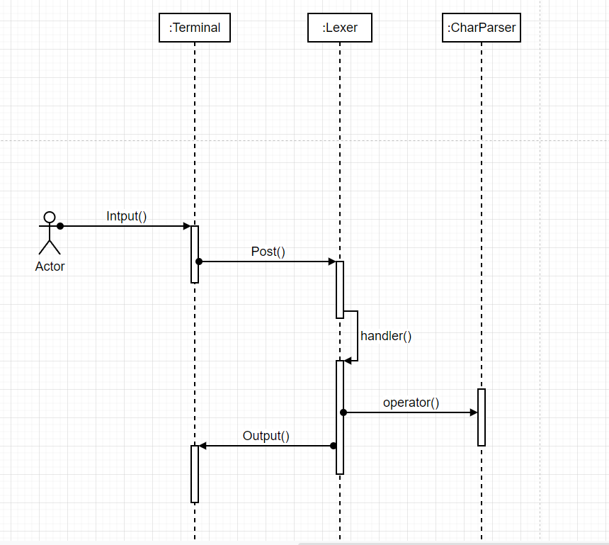

# lexer

This lab is to complete a simple lexical analyzer which parse string to tokens.For example, input the code of `int n = 2;`  to lexical analyzer,it will be resloved as follows
```
< Int : int
< Identifier : n
< Operator : =
< IntLiteral : 2
```

In order to parse string like this,we have to design a finite-state machine.To improve state machine scalability,we can use template and polymorphic to design an interface class.it includes state and state of handlers,user can custom status and add handlers to slove it.
```cpp
template <typename T, typename U, typename F>
class StatusMachine {
public:
    using HandlerMap = std::unordered_map<T, F>;
    using StateType = T;
    using ValueType = U;

    StatusMachine() = default;

    StatusMachine(StateType state, const HandlerMap &m = HandlerMap())
        : state_(state), handlers_(m) {}

    void Register(StateType state, const F &f) {
        handlers_[state] = f;
    }

    void Register(const HandlerMap &m) {
        handlers_.insert(m.begin(), m.end());
    }

    void setState(StateType state) {
        state_ = state;
    }
    void getState() const {
        return state_;
    }

    virtual bool Post(U c) = 0;

    virtual ~StatusMachine() {}

protected:
    StateType state_;
    HandlerMap handlers_;
};
```


